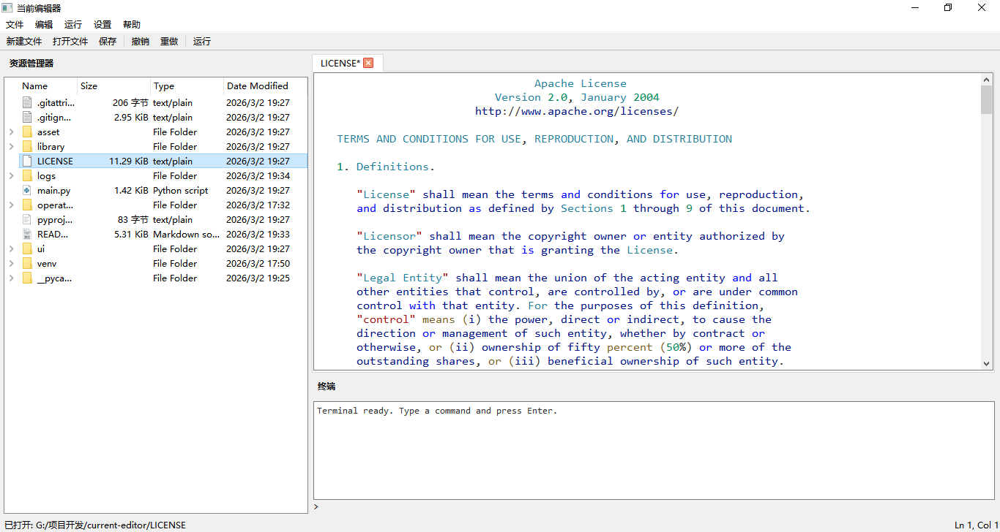

<div align="center">

# Current Editor

**一款基于 Tkinter + Python 构建的现代化国产可替代的代码编辑器**

[](https://www.python.org/)
[](https://www.riverbankcomputing.com/software/pyqt/)
[](./LICENSE)

[English](#english) | 简体中文

</div>

---

## ✨ 功能特性

- 🖥️ **现代化界面** - 简洁美观的用户界面设计
- 🎨 **多主题支持** - 内置 13+ 款精美主题
- 📝 **语法高亮** - 支持多种编程语言的语法高亮
- 📁 **文件管理** - 内置文件资源管理器，轻松浏览项目
- 💻 **集成终端** - 内置终端，无需切换窗口
- 🌐 **国际化** - 支持中文/英文界面
- ⚡ **代码运行** - 一键运行 Python 代码

---

## 📸 应用预览

<div align="center">


<p style="font-style: italic; color: #666;">Windows 效果图</p>

</div>

---

## 🚀 快速开始

### 环境要求

- Python 3.8 或更高版本
- pip 包管理器
- npm 包管理器

### 安装步骤

1. **克隆仓库**

```bash
git clone https://gitee.com/chengzi404-byte/current-editor.git
cd current-editor
```

2. **创建虚拟环境（推荐）**

```bash
python -m venv venv

# Windows
venv\Scripts\activate

# Linux/macOS
source venv/bin/activate
```

3. **安装依赖**

```bash
pip install PyQt6 PySide6 pylint flake8
npm install pyright -g # 可选，用于代码高亮和代码诊断
```

4. **运行程序**

```bash
python main.py
```

---

## 🎨 主题预览

Current Editor 内置多款精美主题：

<div align="center">

| 主题 | 预览 |
|:---:|:---:|
| GitHub Dark | 深色主题 |
| GitHub Light | 浅色主题 |
| VSCode Dark | VSCode 风格深色 |
| VSCode Light | VSCode 风格浅色 |
| One Dark Pro | Atom 风格 |
| Dracula | 经典 Dracula |
| Monokai | Sublime 经典 |
| Nord | 北欧风格 |
| Material | Material Design |
| Solarized Dark | Solarized 深色 |
| Solarized Light | Solarized 浅色 |

</div>

---

## 📁 项目结构

```
current-editor/
├── asset/                  # 资源文件
│   ├── lang/              # 国际化语言文件
│   │   ├── zh.json        # 中文
│   │   └── en.json        # 英文
│   ├── theme/             # 主题文件
│   │   ├── github-dark.json
│   │   ├── vscode-dark.json
│   │   └── ...
│   └── settings.json      # 配置文件
├── library/               # 核心库
│   ├── api.py            # 配置 API
│   ├── i18n.py           # 国际化支持
│   ├── logger.py         # 日志系统
|   └── ...
├── ui/                    # 用户界面
│   ├── main_window.py    # 主窗口
│   ├── file_browser.py    # 语法高亮
│   ├── menu.py       # 终端组件
│   └── tabs.py     # LSP 客户端
├── main.py               # 程序入口
├── pyproject.toml        # 项目配置
└── LICENSE               # 许可证
```

---

## ⚙️ 配置说明

配置文件位于 `asset/settings.json`：

```json
{
    "editor.file-encoding": "utf-8",
    "editor.lang": "zh",
    "editor.font": "Consolas",
    "editor.fontsize": 12,
    "editor.file-path": "./temp",
    "highlighter.syntax-highlighting": {
        "theme": "vscode-light",
        "enable-type-hints": true,
        "enable-docstrings": true,
        "code": "python"
    },
    "run.timeout": 1000,
    "run.racemode": false
}
```

### 配置项说明

| 配置项 | 说明 | 默认值 |
|:---|:---|:---|
| `editor.file-encoding` | 文件编码 | `utf-8` |
| `editor.lang` | 界面语言 | `zh` |
| `editor.font` | 编辑器字体 | `Consolas` |
| `editor.fontsize` | 字体大小 | `12` |
| `highlighter.syntax-highlighting.theme` | 主题名称 | `vscode-light` |

---

## ⌨️ 快捷键

| 快捷键 | 功能 |
|:---:|:---|
| `Ctrl + N` | 新建文件 |
| `Ctrl + O` | 打开文件 |
| `Ctrl + S` | 保存文件 |
| `Ctrl + Shift + S` | 另存为 |
| `Ctrl + Z` | 撤销 |
| `Ctrl + Y` | 重做 |
| `Ctrl + X` | 剪切 |
| `Ctrl + C` | 复制 |
| `Ctrl + V` | 粘贴 |
| `F5` | 运行代码 |
| `Ctrl + Q` | 退出 |

---

## 🔌 支持的语言

语法高亮支持以下编程语言：

- Python (`.py`)
- JavaScript (`.js`)
- HTML (`.html`)
- CSS (`.css`)
- JSON (`.json`)
- XML (`.xml`)
- YAML (`.yaml`, `.yml`)
- Markdown (`.md`)
- C/C++ (`.c`, `.cpp`)
- Java (`.java`)
- Rust (`.rs`)
- Go (`.go`)
- Ruby (`.rb`)
- PHP (`.php`)
- Bash (`.sh`)

---

## 🤝 参与贡献

欢迎所有形式的贡献！

1. Fork 本仓库
2. 创建特性分支 (`git checkout -b feature/AmazingFeature`)
3. 提交更改 (`git commit -m 'Add some AmazingFeature'`)
4. 推送到分支 (`git push origin feature/AmazingFeature`)
5. 提交 Pull Request

**贡献榜单（不定期更新）：**

* **chengzi404-byte**
* **Eason**

---

## 📄 许可证

本项目采用 Apache License 2.0 - 详见 [LICENSE](./LICENSE) 文件

---

<div align="center">

## 🌟 Star History

如果这个项目对你有帮助，请给一个 ⭐️ Star！

</div>

再此感谢所有的贡献者！

